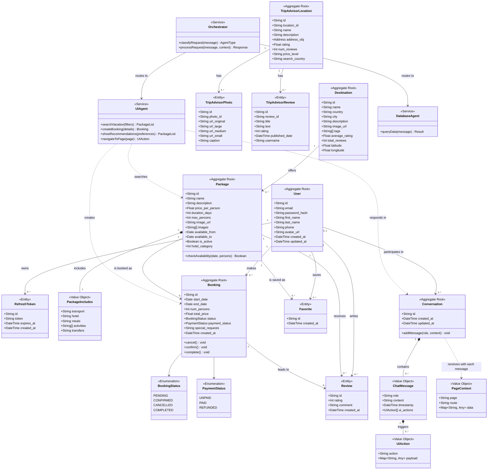

# VacanceAI - Domain Model (DDD)

## Bounded Contexts

```
+---------------------+     +---------------------+     +---------------------+
|      Identity       |     |       Catalog        |     |    Hotel Discovery  |
|                     |     |                      |     |                     |
|  User               |     |  Destination         |     |  TripAdvisorLocation|
|  RefreshToken       |     |  Package             |     |  TripAdvisorPhoto   |
|  AccessToken (VO)   |     |  PackageIncludes(VO) |     |  TripAdvisorReview  |
+---------------------+     +---------------------+     +---------------------+
          |                           |
          |   +----------+            |
          +-->|  Booking  |<-----------+
          |   +----------+
          |
          |   +----------+
          +-->|  Social   |
              |           |
              |  Review   |
              |  Favorite |
              +----------+
                                     +---------------------+
                                     |    Conversation      |
                                     |                      |
                                     |  Conversation        |
                                     |  ChatMessage (VO)    |
                                     |  UIAction (VO)       |
                                     |  PageContext (VO)     |
                                     +---------------------+

                                     +---------------------+
                                     |    AI Agents         |
                                     |                      |
                                     |  Orchestrator        |
                                     |  UIAgent             |
                                     |  DatabaseAgent       |
                                     +---------------------+
```

## UML Class Diagram (Mermaid)



## Aggregate Boundaries

| Aggregate Root       | Owned Entities / Value Objects                        | Invariants                                                     |
|----------------------|-------------------------------------------------------|----------------------------------------------------------------|
| **User**             | RefreshToken                                          | Email must be unique. Password is hashed (bcrypt).             |
| **Destination**      | (tags as JSON)                                        | Country is required. Rating is computed from package reviews.  |
| **Package**          | PackageIncludes (VO)                                  | Price > 0. Duration > 0. available_from < available_to.        |
| **Booking**          | BookingStatus (enum), PaymentStatus (enum)            | num_persons <= package.max_persons. total_price = price x num. |
| **Review**           | -                                                     | Rating between 1 and 5. One review per user per booking.       |
| **Favorite**         | -                                                     | Unique constraint on (user_id, package_id).                    |
| **Conversation**     | ChatMessage (VO), UIAction (VO), PageContext (VO)     | Messages are append-only and ordered.                          |
| **TripAdvisorLocation** | TripAdvisorPhoto, TripAdvisorReview                | location_id is unique (external identifier).                   |

## Context Map (Relationships)

```
Identity ----[Customer/Supplier]----> Booking
Identity ----[Customer/Supplier]----> Social
Identity ----[Customer/Supplier]----> Conversation
Catalog  ----[Customer/Supplier]----> Booking
Catalog  ----[Customer/Supplier]----> Social
Conversation --[Conformist]---------> AI Agents
AI Agents ----[Anticorruption Layer]-> Catalog
AI Agents ----[Anticorruption Layer]-> Booking
Hotel Discovery --[Separate Ways]----> Catalog (no direct FK)
```
